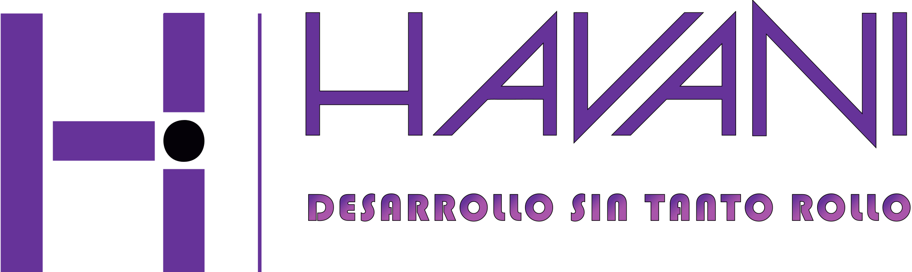

# Havani Landing Page



A modern, responsive landing page for Havani, a software development company with a "Sin Tanto Rollo" (no-nonsense) approach. This project showcases a React-based website with sleek animations, custom components, and a developer-friendly codebase.

## 📋 Features

- **Fully Responsive Design** - Optimized for mobile, tablet, and desktop
- **Rich Animation System** - Smooth transitions and micro-interactions powered by Framer Motion
- **Performance Optimized** - Adaptive rendering based on device capabilities
- **Accessible UI Components** - ARIA compliant components and keyboard navigation
- **Modern Tech Stack** - React + TypeScript + Tailwind CSS
- **Developer Experience** - Hot module reloading, ESLint integration, and well-structured codebase

## 🚀 Key Sections

- **Hero Section** - Bold introduction with animated background
- **Value Proposition** - Core pillars of Havani's approach
- **Problem/Solution** - Explaining how Havani solves common development challenges
- **Process** - Four-step development methodology
- **Services** - Services offered by Havani
- **Products** - Featured products (NeuralCrane, AutoMike, Conciliador)
- **Benefits** - Key advantages of working with Havani
- **Testimonials** - Client testimonials with elegant animation
- **Comparison** - Side-by-side comparison with traditional development
- **Technology Stack** - Visual showcase of technologies used
- **Contact Form** - Dynamic form with validation and smooth animation

## 🔧 Technologies Used

### Frontend Framework
- React 18 with TypeScript
- React Router for navigation

### Styling
- Tailwind CSS with custom configuration
- CSS Variables for theming
- Class Variance Authority (CVA) for component variants

### Animation & Effects
- Framer Motion for complex animations
- GSAP for parallax effects
- Custom animation hooks and utilities

### State Management
- React Context API
- Custom hooks for logic separation

### Form Handling
- Custom form hooks for validation
- Animated form transitions

### Performance
- Code splitting with React.lazy()
- Optimized image loading with lazy loading
- Adaptive rendering based on device capabilities

### Build Tools
- Vite for fast development and optimized builds
- PostCSS for CSS processing
- SWC for fast transpilation

## 📥 Installation

```bash
# Clone the repository
git clone https://github.com/your-username/havani-landing-page.git

# Navigate to the project directory
cd havani-landing-page

# Install dependencies
npm install

# Start the development server
npm run dev
```

## 🏃‍♂️ Usage

```bash
# Start development server
npm run dev

# Build for production
npm run build

# Preview production build
npm run preview

# Lint the project
npm run lint
```

## 📁 Project Structure

```
havani-landing-page/
├── public/                  # Static assets
├── src/
│   ├── components/          # Reusable UI components
│   │   ├── sections/        # Page sections
│   │   └── ui/              # UI primitives
│   ├── hooks/               # Custom React hooks
│   ├── lib/                 # Utility functions
│   ├── pages/               # Page components
│   ├── styles/              # Global styles
│   ├── types/               # TypeScript type definitions
│   ├── App.tsx              # Main application component
│   ├── main.tsx             # Application entry point
│   └── index.css            # Global CSS
├── .eslintrc.js             # ESLint configuration
├── postcss.config.js        # PostCSS configuration
├── tailwind.config.ts       # Tailwind CSS configuration
├── tsconfig.json            # TypeScript configuration
├── vite.config.ts           # Vite configuration
└── package.json             # Project dependencies and scripts
```

## 🎨 Customization

### Colors

The primary color scheme is defined in `index.css` as CSS variables:

```css
:root {
  --bg-body: #000000;
  --bg-panel: #15161B;
  --bg-highlight: #1F2026;
  --accent: #7B61FF;
  /* ...more variables */
}
```

### Typography

This project uses system fonts by default, configured in the Tailwind theme:

```js
// tailwind.config.ts
fonts: {
  sans: ['system-ui', '-apple-system', /* ...other fonts */],
}
```

### Icons

The project uses Lucide React for icons:

```tsx
// Using icons in components
import { ArrowRight } from 'lucide-react';

// <ArrowRight className="w-5 h-5" />
```

## 👥 Contributors

- Development Team at Havani

## 📄 License

This project is proprietary software. © 2025 Havani. All rights reserved.

---

## 🙋‍♀️ Have Questions?

For questions and support, please contact [hello@havani.dev](mailto:hello@havani.dev)